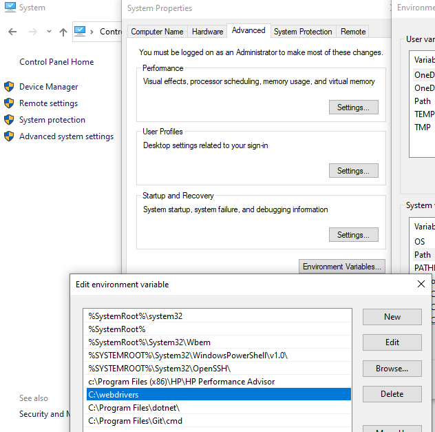
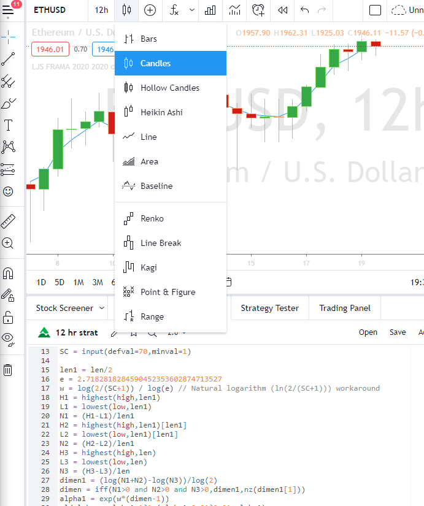

# Coinbase Trading Bot

### Background

This bot trades a crypto of your choice every 12 hours. 

NOTE: This will only work on one single crypto and you must have no other money anywhere else except either in the crypto or sitting in cash, as this bot will trade with 100% of your portfolio with that one crypto!

### Setup

NOTE: Only works on Windows/Mac + Google Chrome + Python3

**<u>Install selenium and VS Code</u>**

1. Get your Google Chrome version: type `chrome://version` in your Google Chrome

2. Navigate to https://chromedriver.chromium.org/ and download corresponding driver version

3. Unzip to folder of your choice

4. Edit your system path variables

   #### For Windows:

   

   Then go to Advanced system settings --> Environment Variables... --> Path, and add the path to the folder where chromedriver is in (C:\webdrivers  in this case)

   

   

   #### For Mac:

   All you need is a single command:

   ```bash
   mv ~/Downloads/chromedriver /usr/local/bin
   ```

   

5. Install VS Code from https://code.visualstudio.com/download


### Setting up Trading View and Python code

Enter your Trading View Personal Link:

1. Bring up your favorite crypto ticker by typing in `COINBASE: ETHUSD` and set time to 12hr candles

2. Go down into Pine Editor

3. Paste this code in and save it

   ```python
   strategy("Coinbase Pro Strategy", shorttitle="Ethereum", initial_capital=3000, overlay=true,currency='USD', default_qty_type=strategy.percent_of_equity, default_qty_value=100, commission_type= strategy.commission.percent, commission_value= 0.0, calc_on_order_fills=true)
   
   fromYear = year >= input(2021) and weekofyear >= 1
   toYear = year <= input(2021)
   
   price = input(close)
   len = input(defval=252,minval=1) // Should be even number
   FC = input(defval=2,minval=1)
   SC = input(defval=70,minval=1)
   
   len1 = len/2
   e = 2.7182818284590452353602874713527
   w = log(2/(SC+1)) / log(e) // Natural logarithm (ln(2/(SC+1))) workaround
   H1 = highest(high,len1)
   L1 = lowest(low,len1)
   N1 = (H1-L1)/len1
   H2 = highest(high,len1)[len1]
   L2 = lowest(low,len1)[len1]
   N2 = (H2-L2)/len1
   H3 = highest(high,len)
   L3 = lowest(low,len)
   N3 = (H3-L3)/len
   dimen1 = (log(N1+N2)-log(N3))/log(2)
   dimen = iff(N1>0 and N2>0 and N3>0,dimen1,nz(dimen1[1]))
   alpha1 = exp(w*(dimen-1))
   oldalpha = alpha1>1?1:(alpha1<0.01?0.01:alpha1)
   oldN = (2-oldalpha)/oldalpha
   N = (((SC-FC)*(oldN-1))/(SC-1))+FC
   alpha_ = 2/(N+1)
   alpha = alpha_<2/(SC+1)?2/(SC+1):(alpha_>1?1:alpha_)
   out = input(close)
   out := (1-alpha)*nz(out[1]) + alpha*price
   plot(out,title="Ethereum strategy",transp=0)
   
   strategy.risk.max_drawdown(value=100, type=strategy.percent_of_equity)
       
   shortCondition = crossunder(close, out)
   if (shortCondition and fromYear and toYear)
       strategy.entry("My Short Entry Id", strategy.short)
       
   longCondition = crossover(close, out)
   if (longCondition and fromYear and toYear)
       strategy.entry("My Long Entry Id", strategy.long)
   ```




Go into the **<u>coinbase_bot_windows/mac.py:</u>**

*NOTE:* If you don't want to trade Ethereum, make sure to change the links in each of the pro.coinbase.com addresses as well.

Modify the code on lines for mac:

- 25: `email_in.send_keys('youremailhere@gmail.com')`
- 35: `email_in.send_keys('youremailhere@gmail.com')`
- 63: `bot.driver.get('https://www.tradingview.com/chart/PERSONAL LINK HERE/')`
- 65: `bot.driver.get('https://www.tradingview.com/chart/PERSONAL LINK HERE/')`
- 145:  `bot.driver.get('https://www.tradingview.com/chart/PERSONAL LINK HERE/')`
- 159:  `bot.driver.get('https://www.tradingview.com/chart/PERSONAL LINK HERE/')`

Modify the code on lines for windows:

- 34: `email_in.send_keys('youremailhere@gmail.com')`
- 45: `bot.driver.get('https://www.tradingview.com/chart/PERSONAL LINK HERE/')`
- 62: `bot.driver.get('https://www.tradingview.com/chart/PERSONAL LINK HERE/')`
- 148:  `bot.driver.get('https://www.tradingview.com/chart/PERSONAL LINK HERE/')`
- 159:  `bot.driver.get('https://www.tradingview.com/chart/PERSONAL LINK HERE/')`
- 170:  `bot.driver.get('https://www.tradingview.com/chart/PERSONAL LINK HERE/')`


**<u>Now run it!</u>**

Spawn a terminal in VS Code

```bash
PS C:\Users\Username\Documents\Robinhood_Bot> python coinbase_bot_windows.py 
```

It'll spawn 2 tabs (one right after the other), you will have 15 seconds to login to Trading View; wait for the next tab to spawn if you login early, and 30 seconds to login to Coinbase Pro respectively. 